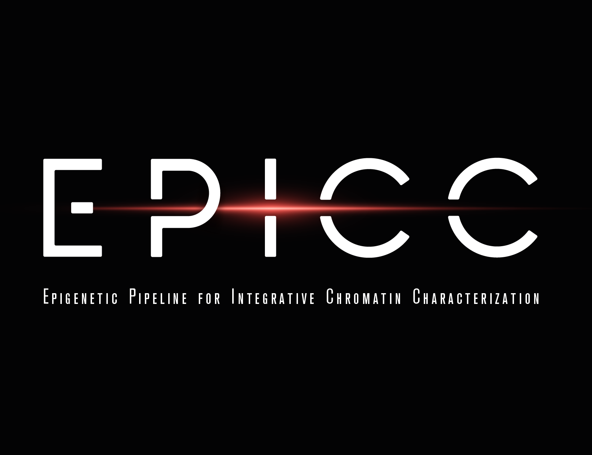

Welcome to EPICC documentation!
===================================

A Snakemake-based pipeline for analyzing and integrating various types of (epi)genomics datasets, including histone and transcription factor ChIP-seq, RNA-seq, RAMPAGE, small RNA-seq, and methylC-seq.

Overview
--------

EpigeneticButton is a comprehensive pipeline that processes and analyzes multiple types of genomics data. It provides an automated workflow for:

- Data preprocessing and quality control
- Read mapping and alignment
- Peak calling and differential expression analysis
- Data integration and visualization

Features
--------

- **Multiple Data Types Support**:

  - Histone ChIP-seq
  - Transcription Factor ChIP-seq
  - RNA-seq
  - small RNA-seq
  - MethylC-seq (mC)
  - RAMPAGE *\*in development*

- **Automated Analysis**:

  - Reference genome preparation  
  - Sample-specific processing
  - Data type-specific analysis
  - Combined analysis across samples
  - Quality control and reporting
  - Additional output options such as heatmaps, metaplots and browsers

- **Flexible Configuration**:

  - App to validate configuration options: `epicc-builder <https://epicc-builder.streamlit.app>`__
  - Customizable mapping parameters
  - Configurable analysis options
  - Resource management
  - Parallel processing

Contents
--------

.. toctree::

   installation
   configuration
   usage
   output
