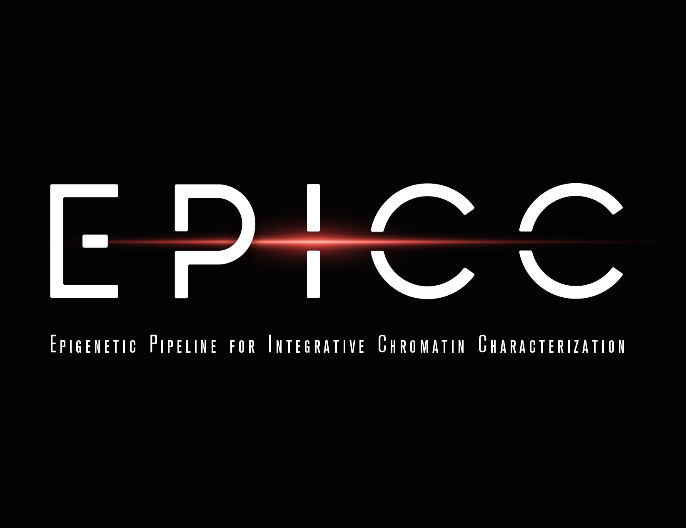

Welcome to EPICC documentation!
===================================

A Snakemake-based pipeline for analyzing and integrating various types of (epi)genomics datasets, including histone and transcription factor ChIP-seq, CUT&RUN, CUT&Tag, ATAC-seq, RNA-seq, RAMPAGE, small RNA-seq, whole-genome bisulfite sequencing, and direct methylation from long-read sequencing.

Overview
--------

EPICC (Epigenetic Pipeline for Integrative Chromatin Characterization) is a comprehensive pipeline that processes and analyzes multiple types of (epi)genomics data. It provides an automated workflow for:

- Data preprocessing and quality control
- Read mapping and alignment
- Peak calling and differential expression analysis
- Data integration and visualization

Features
--------

- **Multiple Data Types Support**:

  - Histone ChIP-seq (broad and narrow peaks)
  - Transcription factor ChIP-seq
  - CUT&RUN (broad and narrow peak variants)
  - CUT&Tag (broad and narrow peak variants)
  - ATAC-seq
  - RNA-seq
  - RAMPAGE
  - small RNA-seq
  - Whole-genome bisulfite sequencing (MethylC-seq): WGBS, WGBS_nd, PBAT, EMseq
  - Direct methylation from long-read sequencing (dmC): Oxford Nanopore, PacBio

- **Automated Analysis**:

  - Reference genome preparation
  - Sample-specific processing
  - Data type-specific analysis
  - Combined analysis across samples
  - Quality control and reporting
  - Additional output options such as heatmaps, metaplots and browsers

- **Flexible Configuration**:

  - Self-contained local HTML builder (``tools/epicc-builder.html``) to build and validate sample sheets and options files — open directly in a browser, no internet connection required
  - Customizable mapping parameters
  - Configurable analysis options
  - Resource management
  - Parallel processing

Contents
--------

.. toctree::

   installation
   configuration
   usage
   output
   help
   credits
