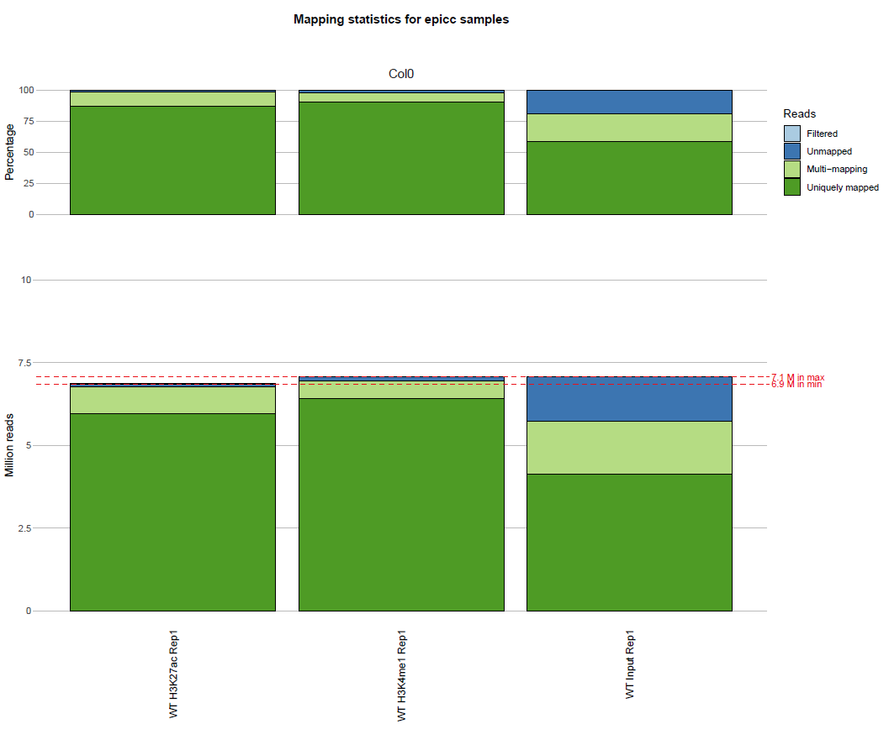
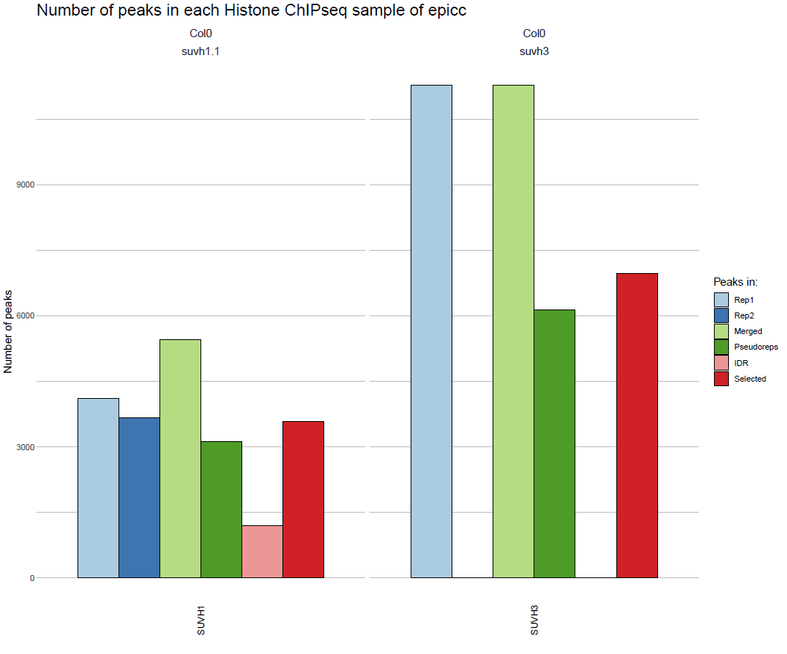
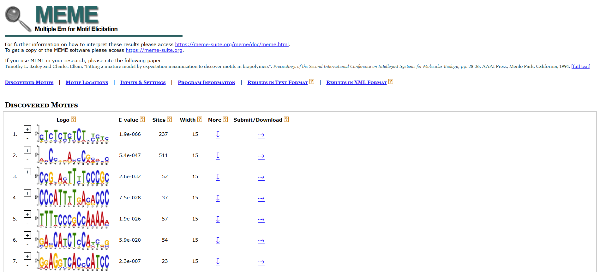
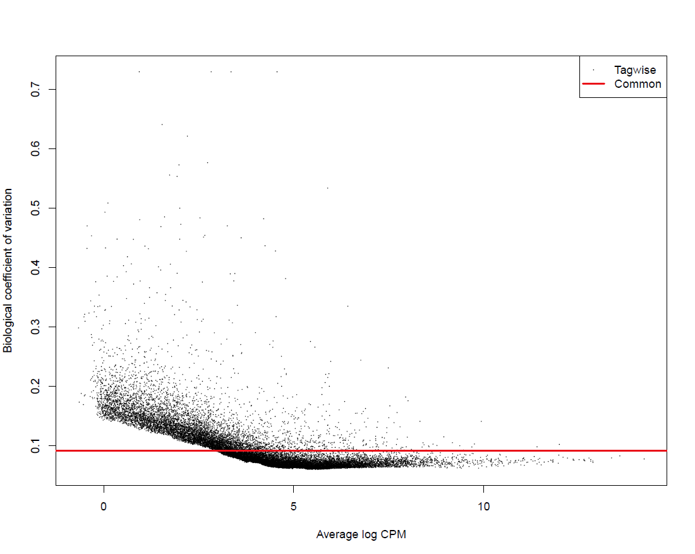
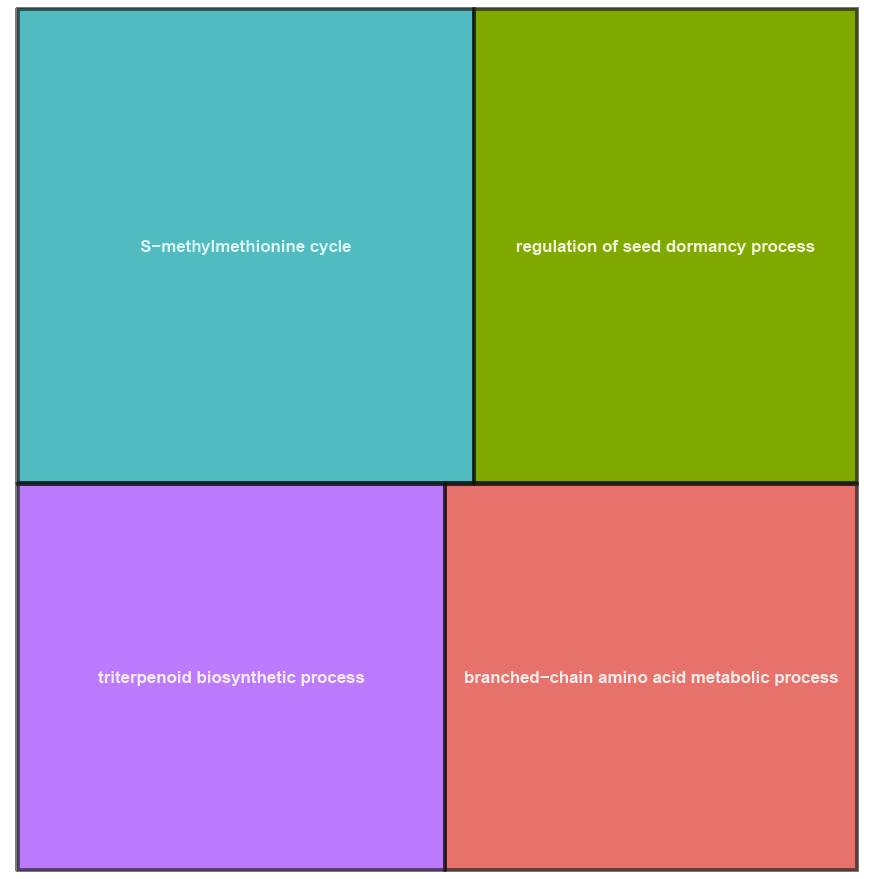
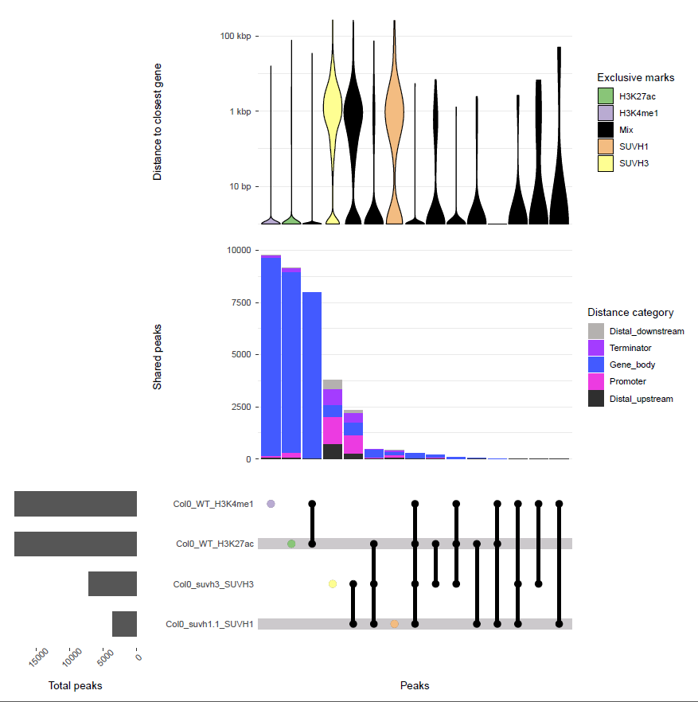

======
Output 
======

Output Structure
================

::

	epigeneticbutton/
	├── config/			# Location for the main config file and recommended location for sample files and target files
	├── data/			# Location for test material and examples (e.g. zm_structural_RNAs.fa.gz)
	├── Help/			# Location for help files (e.g. Help_structural_RNAs_database_with_Rfam)
	├── profiles/
	│	├── sge/		# Config file to run snakemake on a cluster managed by SGE
	│	└── slurm/		# Config file to run snakemake on a cluster managed by SLURM
	├── workflow/
	│	├── envs/		# Conda environment file for depencies
	│	├── rules/		# Snakemake files with data type analysis rules
	│	├── scripts/		# R scripts for plots
	│	└── snakefile		# main snakefile
	├── genomes/			# Genome directories created upon run
	│	└── {ref_genome}/	# Reference genome directories with sequence, annotation and indexes
	└── results/			# Results directories created upon run
		├── combined/		# Combined analysis results
		│	├── bedfiles/	# Peak calling results
		│	├── chkpts/	# Empty checkpoint files used for pipeline logic. Deleting them will trigger rerunning the corresponding analysis
		│	├── logs/	# Log files
		│	├── matrix/	# Data matrices
		│	├── plots/	# Visualization plots
		│	└── reports/	# Analysis reports 
		└── <env>/	# Data type specific directories
			├── chkpts/	# Empty checkpoint files used for pipeline logic. Deleting them will trigger rerunning the corresponding analysis
			├── fastq/	# Processed FASTQ files
			├── logs/	# Log files
			├── mapped/	# Mapped reads (bam)
			├── plots/	# Data type specific plots
			├── reports/	# QC reports
			├── tracks/	# Track files (bigwigs)
			└── */		# data-specific directories (e.g. 'peaks' for ChIP, 'peaks' and 'motifs' for TF, 'DEG' for RNA, 'DMRs' and 'methylcall' for mC, 'clusters' for sRNA)

Data-specific Output
====================

Histone ChIP-seq
----------------

Output tree:

::

	ChIP/
	├── chkpts/	# Empty checkpoint files used for pipeline logic. Deleting them will trigger rerunning the corresponding analysis
	├── fastq/	# Processed FASTQ files
	├── logs/	# Log files
	├── mapped/	# Mapped reads (bam)
	├── peaks/	# Peak files (MACS2 output) for each replicate, pseudo-replicate and merged biological replicates and selected peaks (shared by merged and both pseudo-replicates).
	├── plots/	# Fingerprints (IP vs Input for each IP sample), IDR if at least two biological replicates
	├── reports/	# QC reports and summary of mapping statistics and peak statistics
	└── tracks/	# Track files (bigwigs); log2FC of IP/Input for each rep and merged if at least 2 biological replicates

Mapping statistics
++++++++++++++++++

data for each sample::

	results/ChIP/reports/summary_ChIP_<paired>_mapping_stats_ChIP__<line>__<tissue>__<sample_type>__<replicate>__<ref_genome>.txt

summary table:: 

	results/combined/reports/summary_mapping_stats_<analysis_name>_ChIP.txt

plot:: 

	results/combined/plots/mapping_stats_<analysis_name>_ChIP.pdf

example:

(the actual output is in pdf format)

Peak statistics
+++++++++++++++

data for each sample:: 

	results/ChIP/reports/summary_ChIP_peak_stats_ChIP__<line>__<tissue>__<sample_type>__<ref_genome>.txt

summary table:: 

	results/combined/reports/summary_peak_stats_<analysis_name>_ChIP.txt

plot:: 

	results/combined/plots/peak_stats_<analysis_name>_ChIP.pdf

(see TF ChIP-seq for an example)

Fingerprints
++++++++++++

Performed with Deeptools.

plot for each biological replicate:: 

	results/ChIP/plots/Fingerprint__final__<data_type>__<line>__<tissue>__<sample_type>__<replicate>__<ref_genome>.png

(see TF ChIP-seq for an example) 

IDR
+++

Performed with IDR.

plot for pairs of biological replicate::

	results/ChIP/plots/idr_<paired>__<data_type>__<line>__<tissue>__<sample_type>__<replicate1>_vs_<replicate2>__<ref_genome>.<narrow|broad>Peak.png

(see TF ChIP-seq for an example)

Upset Plot
++++++++++

Perfomed with ComplexUpset.

Table of combined peaks for all histone ChIP-seq samples in the analysis::

	results/combined/bedfiles/combined_peaks__ChIP__<analysis_name>__<ref_genome>.bed

Table of combined peaks for all histone ChIP-seq samples in the analysis annotated based on the closest gene::

	results/combined/bedfiles/annotated__combined_peaks__ChIP__<analysis_name>__<ref_genome>.bed

Upset plot::

	results/combined/plots/Upset_combined_peaks__ChIP__<analysis_name>__<ref_genome>.pdf

(see Combined Output for an example)

TF ChIP-seq
-----------

Output tree:

::

	TF/
	├── chkpts/	# Empty checkpoint files used for pipeline logic. Deleting them will trigger rerunning the corresponding analysis
	├── fastq/	# Processed FASTQ files
	├── logs/	# Log files
	├── mapped/	# Mapped reads (bam)
	├── motifs/	# Motifs analysis with the MEME suite, one folder per selected and idr peaks (and per replicates if so chosen in the config file)
	├── peaks/	# Peak files (MACS2 output) for each replicate, pseudo-replicate and merged biological replicates and selected peaks (shared by merged and both pseudo-replicates).
	├── plots/	# Fingerprints (IP vs Input for each IP sample), IDR if at least two biological replicates
	├── reports/	# QC reports and summary of mapping statistics and peak statistics
	└── tracks/	# Track files (bigwigs); log2FC of IP/Input for each rep and merged if at least 2 biological replicates

Mapping statistics
++++++++++++++++++

data for each sample:: 

	results/TF/reports/summary_TF_<paired>_mapping_stats_<data_type>__<line>__<tissue>__<sample_type>__<replicate>__<ref_genome>.txt

summary table:: 
	
	results/combined/reports/summary_mapping_stats_<analysis_name>_TF.txt

plot::
	
	results/combined/plots/mapping_stats_<analysis_name>_TF.pdf

(see histone ChIP-seq for an example) 

Peak statistics
+++++++++++++++

data for each sample::

	results/TF/reports/summary_TF_peak_stats_<dat_type>__<line>__<tissue>__<sample_type>__<ref_genome>.txt

summary table:: 

	results/combined/reports/summary_peak_stats_<analysis_name>_TF.txt

plot:: 

	results/combined/plots/peak_stats_<analysis_name>_TF.pdf

example:

(the actual output is in pdf format)

Fingerprints
++++++++++++

Performed with Deeptools.

plot for each biological replicate:: 

	results/ChIP/plots/Fingerprint__final__<data_type>__<line>__<tissue>__<sample_type>__<replicate>__<ref_genome>.png

example:

.. image:: images/Fingerprint__final__TF_SUVH1__Col0__suvh1.1__IP__Rep1__ColCEN.png

IDR
+++

Performed with IDR.

plot for pairs of biological replicate::

	results/ChIP/plots/idr_<paired>__<data_type>__<line>__<tissue>__<sample_type>__<replicate1>_vs_<replicate2>__<ref_genome>.<narrow|broad>Peak.png

example:

.. image:: images/idr_se__TF_SUVH1__Col0__suvh1.1__IP__Rep1_vs_Rep2__ColCEN_peaks.narrowPeak.png

Motifs
++++++

Performed with the MEME suite.

Full output from selected peaks (and idr peaks if available) for each sample::

	results/TF/motifs/selected_peaks__<data_type>__<line>__<tissue>__<sample_type>__<ref_genome>/meme/

which includes:: 

	results/TF/motifs/selected_peaks__<data_type>__<line>__<tissue>__<sample_type>__<ref_genome>/meme/meme_out/meme.html

example:

(the actual output is html format, and others)

Upset Plot
++++++++++

Perfomed with ComplexUpset.

Table of combined peaks for all TF ChIP-seq samples in the analysis::

	results/combined/bedfiles/combined_peaks__TF__<analysis_name>__<ref_genome>.bed

Table of combined peaks for all TF ChIP-seq samples in the analysis annotated based on the closest gene::

	results/combined/bedfiles/annotated__combined_peaks__TF__<analysis_name>__<ref_genome>.bed

Upset plot::

	results/combined/plots/Upset_combined_peaks__TF__<analysis_name>__<ref_genome>.pdf

(see Combined Output for an example)

RNA-seq
-------

Output tree:

::

	RNA/
	├── chkpts/	# Empty checkpoint files used for pipeline logic. Deleting them will trigger rerunning the corresponding analysis
	├── DEG/ # Differential Expression Analysis results. Contains count tables, list of differential expression genes for all pairwise comparisons, gene expression tables and RData object for plotting gene expression (see `usage - plotting differential expression`).
	├── fastq/	# Processed FASTQ files
	├── GO/	# Gene Ontology Analysis results (optional). Contains GO terms enriched in sets of DEGs uniquely UP- or DOWN-regulated in each sample, and in additional GO analysis (see `usage - GO analysis`)
	├── logs/	# Log files
	├── mapped/	# Mapped reads (bam)
	├── plots/	# Fingerprints (IP vs Input for each IP sample), IDR if at least two biological replicates
	├── reports/	# QC reports and summary of mapping statistics and peak statistics
	└── tracks/	# Track files (bigwigs); log2FC of IP/Input for each rep and merged if at least 2 biological replicates

Mapping statistics
++++++++++++++++++

data for each sample::

	results/RNA/reports/summary_RNA_<paired>_mapping_stats_<data_type>__<line>__<tissue>__<sample_type>__<replicate>__<ref_genome>.txt

summary table:: 
	
	results/combined/reports/summary_mapping_stats_<analysis_name>_RNA.txt

plot::
	
	results/combined/plots/mapping_stats_<analysis_name>_RNA.pdf

(see histone ChIP-seq for an example) 

Differential Expression analysis
++++++++++++++++++++++++++++++++

Counts from STAR; analysis performed with EdgeR.

count data for each RNAseq sample::

	results/RNA/DEG/counts__<data_type>__<line>__<tissue>__<sample_type>__<replicate>__<ref_genome>.tab

summary tables for all RNAseq samples used for the analysis:: 
	
	results/RNA/DEG/counts__<analysis_name>__<ref_genome>.txt # Count data output by STAR
	results/RNA/DEG/samples__<analysis_name>__<ref_genome>.txt # Table of samples information for edgeR analysis
	results/RNA/DEG/genes_rpkm__<analysis_name>__<ref_genome>.txt # Table of gene expression values for all genes in all samples in Reads per Kilobase Million (RPKM)

output tables of differentially expressed genes (DEG) for each pairwise comparison:: 
	
	results/RNA/DEG/FC_<analysis_name>__<ref_genome>__<line_sample1>__<tissue_sample1>_vs_<line_sample2>__<tissue_sample2>.txt # all genes in logFC sample1/sample2 and their differential statistics
	results/RNA/DEG/FC_<analysis_name>__<ref_genome>__<line_sample1>__<tissue_sample1>_vs_<line_sample2>__<tissue_sample2>.txt # only DEGs

output summary tables of DEGs for all pairwise comparisons:: 

	results/RNA/DEG/summary_DEG_stats__<analysis_name>__<ref_genome>.txt # number of differential expressed genes in all pairwise comparisons and uniquely regulated in each sample
	results/RNA/DEG/unique_DEGs__<analysis_name>__<ref_genome>.txt # list of genes uniquely regulated in each sample

Rdata object for plotting expression levels::

	results/RNA/DEG/ReadyToPlot__<analysis_name>__<ref_genome>.RData

Global output from the differential analysis::

	results/combined/plots/BCV_RNAseq_<analysis_name>_<ref_genome>.pdf # Biological Coefficient of Variation of all genes
	results/combined/plots/MDS_RNAseq_<analysis_name>_<ref_genome>_d12.pdf # Multidimensional scaling of all the samples on the first two dimensions, with dots instead of labels
	results/combined/plots/MDS_RNAseq_<analysis_name>_<ref_genome>_d12_labs.pdf # Multidimensional scaling of all the samples on the first two dimensions, with labels instead of dots
	results/combined/plots/MDS_RNAseq_<analysis_name>_<ref_genome>_d23.pdf # Multidimensional scaling of all the samples on the first two dimensions, with dots instead of labels
	results/combined/plots/MDS_RNAseq_<analysis_name>_<ref_genome>_d23_labs.pdf # Multidimensional scaling of all the samples on the first two dimensions, with labels instead of dots

Examples:

	BCV plot output for each complete DEG analysis

.. figure::

   .. grid:: 2
      :gutter: 2

      .. grid-item::

         .. image:: images/MDS1.png
            :width: 100%

      .. grid-item::

         .. image:: images/MDS2.png
            :width: 100%

      .. grid-item::

         .. image:: images/MDS3.png
            :width: 100%

      .. grid-item::

         .. image:: images/MDS4.png
            :width: 100%

   Four MDS plots output for each complete DEG analysis

Heatmap of all DEGs across all samples::
	
	results/combined/plots/Heatmap_RNAseq_cpm__<analysis_name>__<ref_genome>.pdf # all gene expression normalized by count per million
	results/combined/plots/Heatmap_RNAseq_zscore__<analysis_name>__<ref_genome>.pdf # each gene normalized by Z-score

Examples:

.. grid:: 2
	:gutter: 2

	.. grid-item::

    	.. image:: images/Heatmap_RNAseq_cpm__epicc__ColCEN.png
        :width: 100%

	.. grid-item::

		.. figure:: images/Heatmap_RNAseq_zscore__epicc__ColCEN.png
		:width: 100%

		Z-score heatmap

(the actual output is in pdf format)

Plots of expression level in all samples for the top 100 DEGs (if present)::
	
	results/combined/plots/plot_expression__<analysis_name>__<ref_genome>__unique_DEGs.pdf

(See Additional Output for an example)

Gene Ontology analysis
++++++++++++++++++++++

Performed with rrvgo and TopGO.

List of Gene Ontology (GO) terms and corresponding Gene IDs (GIDs) enriched in the DEGs uniquely UP- and DOWN-regulated in each sample::

	results/RNA/GO/topGO_DOWN_in_<line>__<tissue>_BP_GOs.txt # Biological Process (BP) GO terms enriched in genes only DOWN-regulated in this sample 
	results/RNA/GO/topGO_DOWN_in_<line>__<tissue>_BP_GIDs.txt # genes in the Biological Process (BP) GO terms enriched in genes only DOWN-regulated in this sample 
	results/RNA/GO/topGO_DOWN_in_<line>__<tissue>_MF_GOs.txt # Molecular Function (MF) GO terms enriched in genes only DOWN-regulated in this sample
	results/RNA/GO/topGO_DOWN_in_<line>__<tissue>_MF_GIDs.txt # genes in the Molecular Function (MF) GO terms enriched in genes only DOWN-regulated in this sample
	results/RNA/GO/topGO_UP_in_<line>__<tissue>_BP_GOs.txt # Biological Process (BP) GO terms enriched in genes only UP-regulated in this sample
	results/RNA/GO/topGO_UP_in_<line>__<tissue>_BP_GIDs.txt # genes in the Biological Process (BP) GO terms enriched in genes only UP-regulated in this sample 
	results/RNA/GO/topGO_UP_in_<line>__<tissue>_MF_GOs.txt # Molecular Function (MF) GO terms enriched in genes only UP-regulated in this sample
	results/RNA/GO/topGO_UP_in_<line>__<tissue>_MF_GIDs.txt # genes in the Molecular Function (MF) GO terms enriched in genes only DOWN-regulated in this sample 
	
Corresponding plots::

	results/RNA/plots/topGO_DOWN_in_<line>__<tissue>_BP_treemap.pdf # Treemap of simplified BP terms in DOWN-regulated genes in this sample
	results/RNA/plots/topGO_DOWN_in_<line>__<tissue>_MF_treemap.pdf # Treemap of simplified MF terms in DOWN-regulated genes in this sample
	results/RNA/plots/topGO_UP_in_<line>__<tissue>_BP_treemap.pdf # Treemap of simplified BP terms in UP-regulated genes in this sample
	results/RNA/plots/topGO_UP_in_<line>__<tissue>_MF_treemap.pdf # Treemap of simplified MF terms in UP-regulated genes in this sample
If not enough terms are enriched, these plots might not be created.

Example (BP_DOWN):

(the actual output is in pdf format)

small RNA-seq
-------------

DNA methylation
---------------

Combined Output
===============

Upset Plot
++++++++++

Perfomed with ComplexUpset.

Table of combined peaks for all TF and histone ChIP-seq samples in the analysis::

	results/combined/bedfiles/combined_peaks__all_chip__<analysis_name>__<ref_genome>.bed

Table of combined peaks for all TF and histone ChIP-seq samples in the analysis annotated based on the closest gene::

	results/combined/bedfiles/annotated__combined_peaks__all_chip__<analysis_name>__<ref_genome>.bed

Upset plot::

	results/combined/plots/Upset_combined_peaks__all_chip__<analysis_name>__<ref_genome>.pdf

Example:

