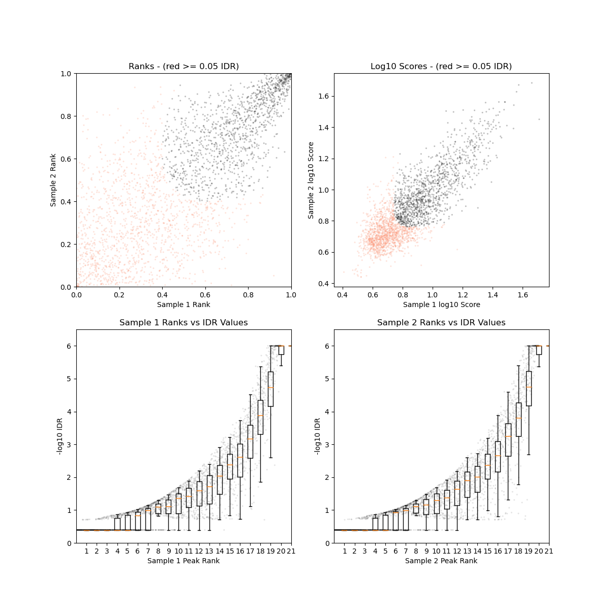

======
Output 
======

Output Structure
================

::

	epigeneticbutton/
	├── config/			# Location for the main config file and recommended location for sample files and target files
	├── data/			# Location for test material and examples (e.g. zm_structural_RNAs.fa.gz)
	├── Help/			# Location for help files (e.g. Help_structural_RNAs_database_with_Rfam)
	├── profiles/
	│	├── sge/		# Config file to run snakemake on a cluster managed by SGE
	│	└── slurm/		# Config file to run snakemake on a cluster managed by SLURM
	├── workflow/
	│	├── envs/		# Conda environment file for depencies
	│	├── rules/		# Snakemake files with data type analysis rules
	│	├── scripts/		# R scripts for plots
	│	└── snakefile		# main snakefile
	├── genomes/			# Genome directories created upon run
	│	└── {ref_genome}/	# Reference genome directories with sequence, annotation and indexes
	└── results/			# Results directories created upon run
		├── combined/		# Combined analysis results
		│	├── bedfiles/	# Peak calling results
		│	├── chkpts/	# Empty checkpoint files used for pipeline logic. Deleting them will trigger rerunning the corresponding analysis
		│	├── logs/	# Log files
		│	├── matrix/	# Data matrices
		│	├── plots/	# Visualization plots
		│	└── reports/	# Analysis reports 
		└── <env>/	# Data type specific directories
			├── chkpts/	# Empty checkpoint files used for pipeline logic. Deleting them will trigger rerunning the corresponding analysis
			├── fastq/	# Processed FASTQ files
			├── logs/	# Log files
			├── mapped/	# Mapped reads (bam)
			├── plots/	# Data type specific plots
			├── reports/	# QC reports
			├── tracks/	# Track files (bigwigs)
			└── */		# data-specific directories (e.g. 'peaks' for ChIP, 'peaks' and 'motifs' for TF, 'DEG' for RNA, 'DMRs' and 'methylcall' for mC, 'clusters' for sRNA)

Data-specific Output
====================

Histone ChIP-seq
----------------

Output tree:

::

	ChIP/
	├── chkpts/	# Empty checkpoint files used for pipeline logic. Deleting them will trigger rerunning the corresponding analysis
	├── fastq/	# Processed FASTQ files
	├── logs/	# Log files
	├── mapped/	# Mapped reads (bam)
	├── peaks/	# Peak files (MACS2 output) for each replicate, pseudo-replicate and merged biological replicates and selected peaks (shared by merged and both pseudo-replicates).
	├── plots/	# Fingerprints (IP vs Input for each IP sample), IDR if at least two biological replicates
	├── reports/	# QC reports and summary of mapping statistics and peak statistics
	└── tracks/	# Track files (bigwigs); log2FC of IP/Input for each rep and merged if at least 2 biological replicates

Mapping statistics
++++++++++++++++++

data for each sample::

	results/ChIP/summary_ChIP_<paired>_mapping_stats_ChIP__<line>__<tissue>__<sample_type>__<replicate>__<ref_genome>.txt

summary table:: 

	/results/combined/reports/summary_mapping_stats_<analysis_name>_ChIP.txt

plot:: 

	/results/combined/plots/mapping_stats_<analysis_name>_ChIP.pdf

example:

.. image:: images/mapping_stats_epicc_ChIP.pdf

Peak statistics
+++++++++++++++

data for each sample:: 

	results/ChIP/summary_ChIP_peak_stats_ChIP__<line>__<tissue>__<sample_type>__<ref_genome>.txt

summary table:: 

	/results/combined/reports/summary_peak_stats_<analysis_name>_ChIP.txt

plot:: 

	/results/combined/plots/peak_stats_<analysis_name>_ChIP.pdf

example:

.. image:: images/peak_stats_epicc_ChIP.pdf

Fingerprints
++++++++++++

plot for each biological replicate:: 

	results/ChIP/plots/Fingerprint__final__<data_type>__<line>__<tissue>__<sample_type>__<replicate>__<ref_genome>.png

(see TF ChIP-seq for example) 

IDR
+++

plot for pairs of biological replicate::

	results/ChIP/plots/idr_<paired>__<data_type>__<line>__<tissue>__<sample_type>__<replicate1>_vs_<replicate2>__<ref_genome>.<narrow|broad>Peak.png

(see TF ChIP-seq for example)

TF ChIP-seq
-----------

Output tree:

::

	TF/
	├── chkpts/	# Empty checkpoint files used for pipeline logic. Deleting them will trigger rerunning the corresponding analysis
	├── fastq/	# Processed FASTQ files
	├── logs/	# Log files
	├── mapped/	# Mapped reads (bam)
	├── motifs/	# Motifs analysis with the MEME suite, one folder per selected and idr peaks (and per replicates if so chosen in the config file)
	├── peaks/	# Peak files (MACS2 output) for each replicate, pseudo-replicate and merged biological replicates and selected peaks (shared by merged and both pseudo-replicates).
	├── plots/	# Fingerprints (IP vs Input for each IP sample), IDR if at least two biological replicates
	├── reports/	# QC reports and summary of mapping statistics and peak statistics
	└── tracks/	# Track files (bigwigs); log2FC of IP/Input for each rep and merged if at least 2 biological replicates

Mapping statistics
++++++++++++++++++

data for each sample:: 

	results/TF/summary_TF_<paired>_mapping_stats_<data_type>__<line>__<tissue>__<sample_type>__<replicate>__<ref_genome>.txt

summary table:: 
	
	/results/combined/reports/summary_mapping_stats_<analysis_name>_TF.txt

plot::
	
	/results/combined/plots/mapping_stats_<analysis_name>_TF.pdf

(see histone ChIP-seq for example) 

Peak statistics
+++++++++++++++

data for each sample::

	results/TF/summary_TF_peak_stats_<dat_type>__<line>__<tissue>__<sample_type>__<ref_genome>.txt

summary table:: 

	/results/combined/reports/summary_peak_stats_<analysis_name>_TF.txt

plot:: 

	/results/combined/plots/peak_stats_<analysis_name>_TF.pdf

(see histone ChIP-seq for example) 

Fingerprints
++++++++++++

plot for each biological replicate:: 

	results/ChIP/plots/Fingerprint__final__<data_type>__<line>__<tissue>__<sample_type>__<replicate>__<ref_genome>.png

example:

.. image:: images/Fingerprint__final__TF_SUVH1__Col0__suvh1.1__IP__Rep1__ColCEN.png

IDR
+++

plot for pairs of biological replicate::

	results/ChIP/plots/idr_<paired>__<data_type>__<line>__<tissue>__<sample_type>__<replicate1>_vs_<replicate2>__<ref_genome>.<narrow|broad>Peak.png

example:

Motifs
++++++

Full output from selected peaks (and idr peaks if available) for each sample::

	results/TF/motifs/selected_peaks__<data_type>__<line>__<tissue>__<sample_type>__<ref_genome>/meme/

which includes:: 

	results/TF/motifs/selected_peaks__<data_type>__<line>__<tissue>__<sample_type>__<ref_genome>/meme/meme_out/meme.html

example:

.. image:: images/meme.html

RNA-seq
-------

small RNA
---------

