======
Output 
======

Output Structure
================

::

	epigeneticbutton/
	├── config/			# Main options file and recommended location for sample files and target files
	├── data/			# Test material and examples (e.g. zm_structural_RNAs.fa.gz)
	├── Help/			# Help files (e.g. Structural_RNAs_Rfam.md, Gene_Ontology.md)
	├── profiles/
	│	├── default/		# Workflow-level per-rule resource/thread defaults
	│	├── geno/		# Example profile for additional scheduler types
	│	├── slurm/		# Config file to run the pipeline on a SLURM cluster
	│	└── uge/		# Config file to run the pipeline on a UGE cluster (qsub)
	├── tools/
	│	└── epicc-builder.html	# Self-contained HTML5 sample sheet and options builder
	├── workflow/
	│	├── envs/		# Conda environment YAML files per analysis type
	│	├── rules/		# Snakemake rule files by data type
	│	├── scripts/		# R and Python scripts for analysis and plotting
	│	└── Snakefile		# Main Snakefile
	├── genomes/			# Genome directories created upon run
	│	└── {ref_genome}/	# Reference genome directories with sequence, annotation and indexes
	└── results/			# Results directories created upon run
		├── .tmp/		# Per-job TMPDIR scratch space (auto-cleaned after each job)
		├── combined/		# Combined analysis results
		│	├── bedfiles/	# Peak calling results
		│	├── chkpts/	# Checkpoint files; delete to trigger rerunning the corresponding analysis
		│	├── logs/	# Log files
		│	├── matrix/	# Data matrices
		│	├── plots/	# Visualization plots
		│	└── reports/	# Analysis reports
		└── <env>/		# Data type specific directories (ChIP, ATAC, RNA, sRNA, mC)
			├── chkpts/	# Checkpoint files; delete to trigger rerunning the corresponding analysis
			├── fastq/	# Processed FASTQ files
			├── logs/	# Log files
			├── mapped/	# Mapped reads (BAM)
			├── plots/	# Data type specific plots
			├── reports/	# QC reports
			├── tracks/	# Track files (bigwigs)
			└── */		# Data-specific directories (e.g. peaks/ for ChIP, DEG/ for RNA, DMRs/ and methylcall/ for mC, clusters/ for sRNA)

ChIP-seq, CUT&RUN, and CUT&Tag
===============================

ChIP-seq (histone marks and transcription factors), CUT&RUN, and CUT&Tag all
share the ``ChIP/`` output directory. Assay types ``ChIP_broad``,
``ChIP_narrow``, ``CUT_RUN_broad``, ``CUT_RUN_narrow``, ``CUT_TAG_broad``, and
``CUT_TAG_narrow`` all route here.

Output tree
+++++++++++

::

	ChIP/
	├── chkpts/	# Checkpoint files; delete to trigger rerunning the corresponding analysis
	├── fastq/	# Processed FASTQ files
	├── logs/	# Log files
	├── mapped/	# Mapped reads (BAM)
	├── peaks/	# Peak files for each replicate, pseudo-replicate, and merged biological replicates; includes selected peaks (shared by merged and both pseudo-replicates)
	├── plots/	# Fingerprints (IP vs control for each IP sample); IDR plots if at least two biological replicates
	├── reports/	# QC reports (Cutadapt/fastp) and summary of mapping statistics and peak statistics
	└── tracks/	# Bigwigs: log2FC of IP/Input for each replicate and merged if at least 2 biological replicates

Mapping metrics
+++++++++++++++

- Data for each sample::

	results/ChIP/reports/summary_ChIP_<Read_layout>_mapping_stats_<Sample_ID>.txt

- Summary table::

	results/combined/reports/summary_mapping_stats_<analysis_name>_ChIP.txt

- Plot::

	results/combined/plots/mapping_stats_<analysis_name>_ChIP.pdf

.. _fig-mapping-stats:

- Example:

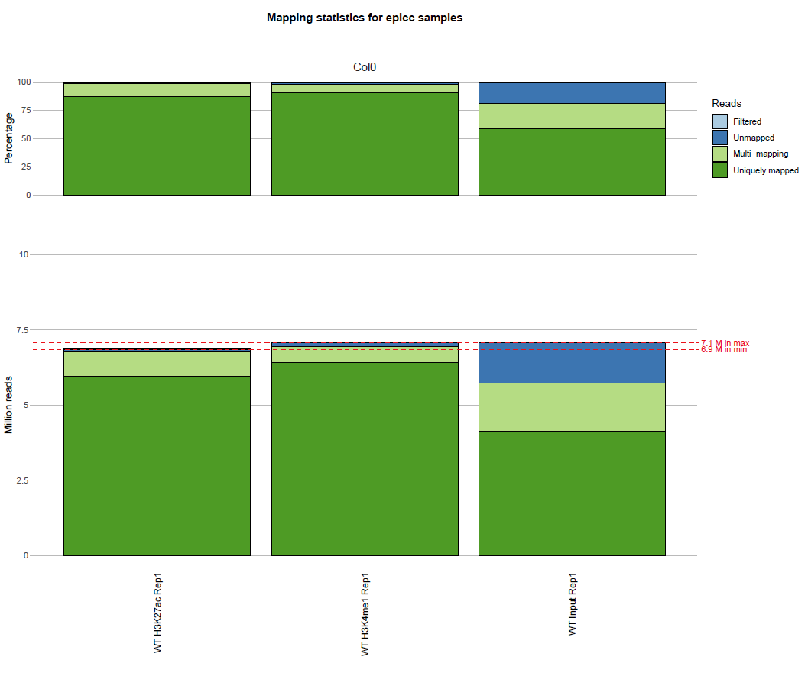

   Histogram of mapping metrics

(the actual output is in pdf format)

Peak metrics
++++++++++++

- Data for each sample::

	results/ChIP/reports/summary_ChIP_peak_stats_<Sample_ID>__<ref_genome>.txt

- Summary table::

	results/combined/reports/summary_peak_stats_<analysis_name>_ChIP.txt

- Plot::

	results/combined/plots/peak_stats_<analysis_name>_ChIP.pdf

.. _fig-peak-stats:

- Example:

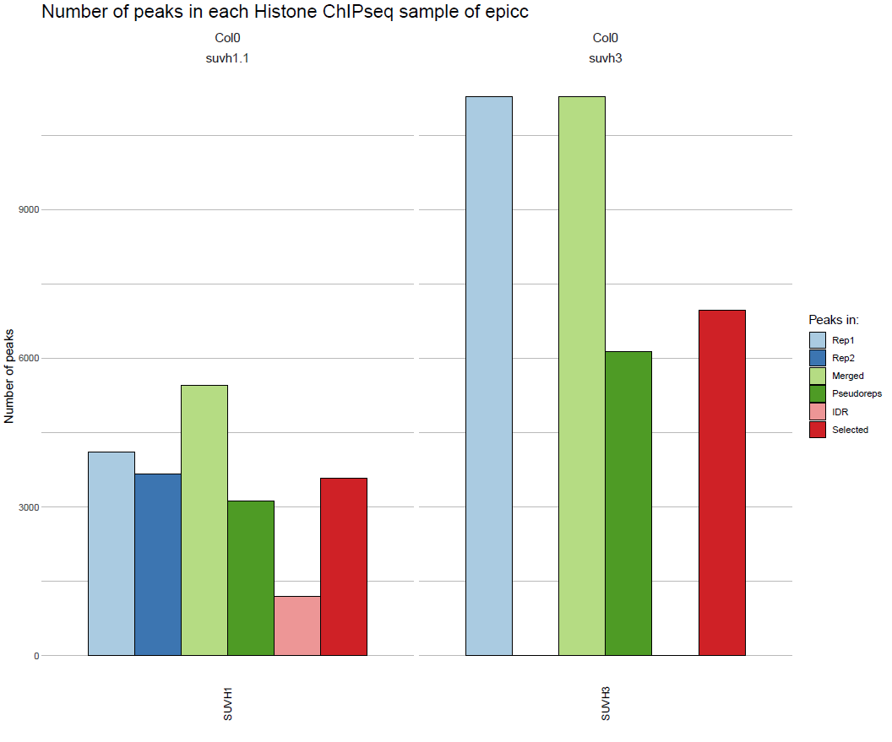

   Histogram of peak metrics

(the actual output is in pdf format)

Fingerprints
++++++++++++

Performed with deeptools.

- Plot for each biological replicate::

	results/ChIP/plots/Fingerprint__final__<Sample_ID>.png

.. _fig-fingerprint:

- Example:

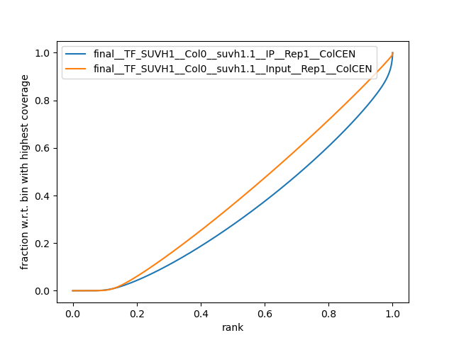

   Fingerprint plot comparing an IP to its control

Irreproducible Discovery Rate
++++++++++++++++++++++++++++++

Performed with IDR.

- Plot for pairs of biological replicates::

	results/ChIP/plots/idr_<Read_layout>__<Sample_ID>__<ref_genome>.<narrow|broad>Peak.png

.. _fig-idr:

- Example:

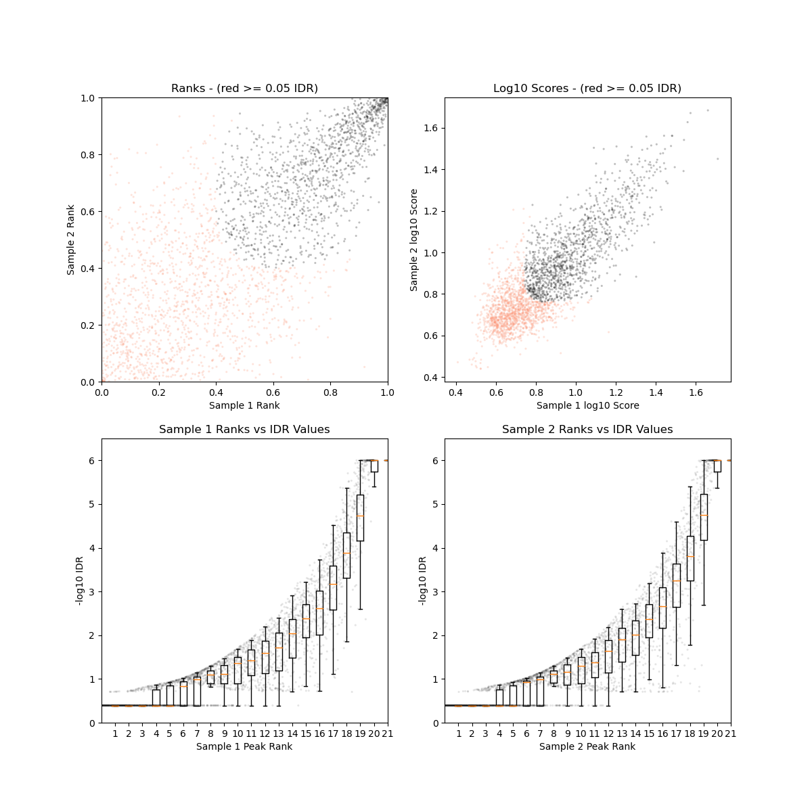

   Plot of Irreproducible Discovery Rate for two biological replicates

.. _ref-motifs-analysis:

Motifs
++++++

Performed with the MEME suite. Available for ``ChIP_narrow`` samples (TF peaks).

- Full output from selected peaks (and IDR peaks if available) for each sample::

	results/ChIP/motifs/selected_peaks__<Sample_ID>__<ref_genome>/meme/

- HTML summary::

	results/ChIP/motifs/selected_peaks__<Sample_ID>__<ref_genome>/meme/meme_out/meme.html

- Example:

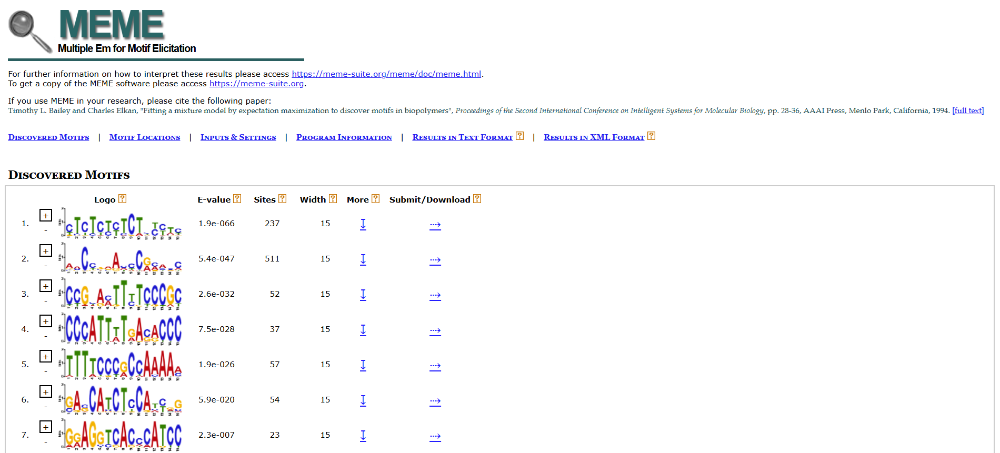

   Screenshot of HTML output from MEME

(the actual output is in HTML format, among others)

Upset Plot
++++++++++

Performed with ComplexUpset.

- Table of combined peaks for all ChIP samples in the analysis::

	results/combined/bedfiles/combined_peaks__ChIP__<analysis_name>__<ref_genome>.bed

- Annotated by closest gene::

	results/combined/bedfiles/annotated__combined_peaks__ChIP__<analysis_name>__<ref_genome>.bed

- Upset plot::

	results/combined/plots/Upset_combined_peaks__ChIP__<analysis_name>__<ref_genome>.pdf

(see :ref:`Combined Output <fig-upset-peaks>` for an example)

RNA-seq
=======

Output tree
+++++++++++

::

	RNA/
	├── chkpts/	# Checkpoint files; delete to trigger rerunning the corresponding analysis
	├── DEG/	# Differential expression analysis results: count tables, DEG lists for all pairwise comparisons, expression tables, and RData object for expression plotting
	├── fastq/	# Processed FASTQ files
	├── GO/		# Gene Ontology analysis results (optional): GO terms enriched in DEGs uniquely UP- or DOWN-regulated in each sample, and in additional GO analyses
	├── logs/	# Log files
	├── mapped/	# Mapped reads (BAM) and STAR output files
	├── plots/	# Expression and GO analysis plots (optional)
	├── reports/	# QC reports (fastp/Cutadapt) and summary of mapping statistics (STAR, samtools)
	└── tracks/	# Bigwigs: plus and minus strand CPM values for each replicate and merged replicates per sample

Mapping metrics
+++++++++++++++

- Data for each sample::

	results/RNA/reports/summary_RNA_<Read_layout>_mapping_stats_<Sample_ID>.txt

- Summary table::

	results/combined/reports/summary_mapping_stats_<analysis_name>_RNA.txt

- Plot::

	results/combined/plots/mapping_stats_<analysis_name>_RNA.pdf

(see :ref:`histone/TF ChIP-seq <fig-mapping-stats>` for an example) 

Differential Expression analysis
++++++++++++++++++++++++++++++++

Counts from STAR; analysis performed with EdgeR.

- Count data for each RNAseq sample::

	results/RNA/DEG/counts__<Sample_ID>.tab

- Summary tables for all RNAseq samples used for the analysis:: 
	
	results/RNA/DEG/counts__<analysis_name>__<ref_genome>.txt # Count data output by STAR
	results/RNA/DEG/samples__<analysis_name>__<ref_genome>.txt # Table of samples information for edgeR analysis
	results/RNA/DEG/genes_rpkm__<analysis_name>__<ref_genome>.txt # Table of gene expression values for all genes in all samples in Reads per Kilobase Million (RPKM)

- Output tables of differentially expressed genes (DEG) for each pairwise comparison:: 
	
	results/RNA/DEG/FC_<analysis_name>__<ref_genome>__<levels_label_1>_vs_<levels_label_2>.txt # all genes in logFC sample1/sample2 and their differential statistics
	results/RNA/DEG/DEG_<analysis_name>__<ref_genome>__<levels_label_1>_vs_<levels_label_2>.txt # only DEGs

  Each ``<levels_label>`` is the ``__``-joined sequence of factor values from the
  sample sheet ``Levels`` column (e.g. ``Col0__seedling`` for
  ``genotype:Col0,tissue:seedling``).

- Output summary tables of DEGs for all pairwise comparisons:: 

	results/RNA/DEG/summary_DEG_stats__<analysis_name>__<ref_genome>.txt # number of differential expressed genes in all pairwise comparisons and uniquely regulated in each sample
	results/RNA/DEG/unique_DEGs__<analysis_name>__<ref_genome>.txt # list of genes uniquely regulated in each sample

- Rdata object for plotting expression levels::

	results/RNA/DEG/ReadyToPlot__<analysis_name>__<ref_genome>.RData

- Global output from the differential analysis::

	results/combined/plots/BCV_RNAseq_<analysis_name>_<ref_genome>.pdf # Biological Coefficient of Variation of all genes
	results/combined/plots/MDS_RNAseq_<analysis_name>_<ref_genome>_d12.pdf # Multidimensional scaling of all the samples on the first two dimensions, with dots instead of labels
	results/combined/plots/MDS_RNAseq_<analysis_name>_<ref_genome>_d12_labs.pdf # Multidimensional scaling of all the samples on the first two dimensions, with labels instead of dots
	results/combined/plots/MDS_RNAseq_<analysis_name>_<ref_genome>_d23.pdf # Multidimensional scaling of all the samples on the first two dimensions, with dots instead of labels
	results/combined/plots/MDS_RNAseq_<analysis_name>_<ref_genome>_d23_labs.pdf # Multidimensional scaling of all the samples on the first two dimensions, with labels instead of dots

.. _fig-bcv-deg:

- Examples:

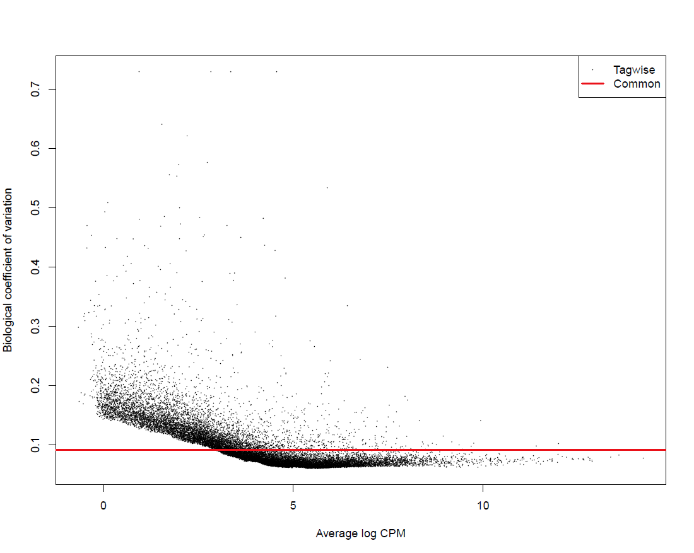

   BCV plot for all genes

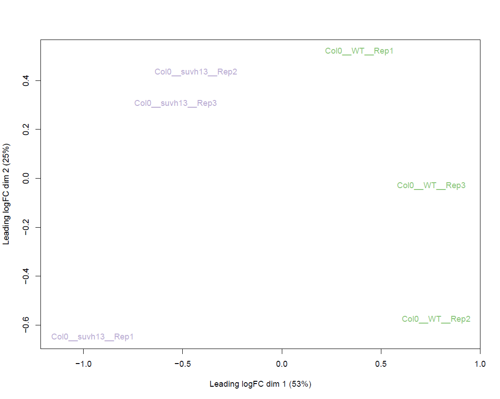

   MDS plot for all RNA-seq samples

- Heatmap of all DEGs across all samples::
	
	results/combined/plots/Heatmap_RNAseq_cpm__<analysis_name>__<ref_genome>.pdf # all gene expression normalized by count per million
	results/combined/plots/Heatmap_RNAseq_zscore__<analysis_name>__<ref_genome>.pdf # each gene normalized by Z-score

- Example:

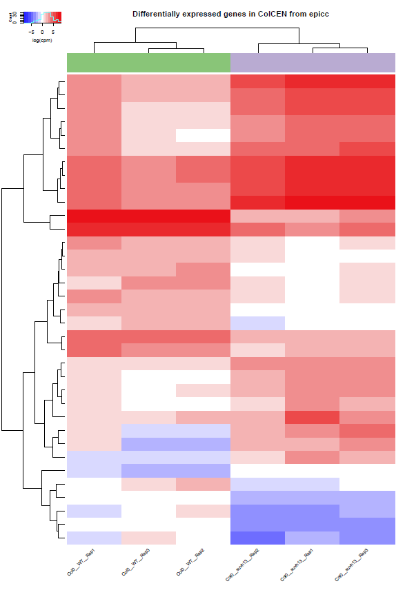

   Heatmap of expression (CPM) in all samples for all the differentially expressed genes in this analysis

(the actual output is in pdf format)

- Plots of expression level in all samples for the top 100 DEGs (if present)::
	
	results/combined/plots/plot_expression__<analysis_name>__<ref_genome>__unique_DEGs.pdf

.. _fig-rna-exp-level:

- Example:

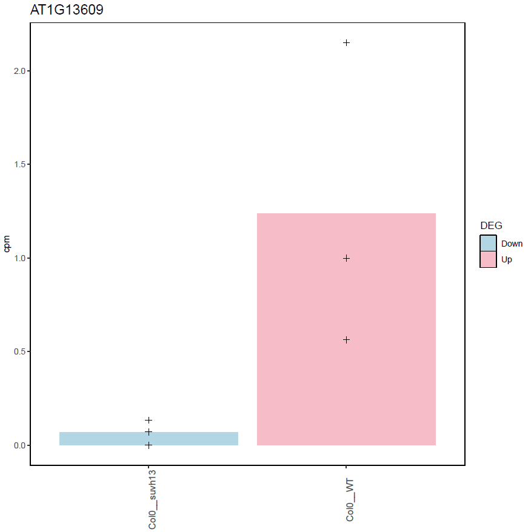

   Histogram of gene expression (RPKM) in the different samples (dots = biological replicates, bar = mean) for one differentially expressed gene

.. _ref-go-analysis:

Gene Ontology analysis
++++++++++++++++++++++

Performed with rrvgo and TopGO.

- List of Gene Ontology (GO) terms and corresponding Gene IDs (GIDs) enriched in the DEGs uniquely UP- and DOWN-regulated in each sample::

	results/RNA/GO/topGO_DOWN_in_<levels_label>_BP_GOs.txt # Biological Process (BP) GO terms enriched in genes only DOWN-regulated in this sample 
	results/RNA/GO/topGO_DOWN_in_<levels_label>_BP_GIDs.txt # genes in the Biological Process (BP) GO terms enriched in genes only DOWN-regulated in this sample 
	results/RNA/GO/topGO_DOWN_in_<levels_label>_MF_GOs.txt # Molecular Function (MF) GO terms enriched in genes only DOWN-regulated in this sample
	results/RNA/GO/topGO_DOWN_in_<levels_label>_MF_GIDs.txt # genes in the Molecular Function (MF) GO terms enriched in genes only DOWN-regulated in this sample
	results/RNA/GO/topGO_UP_in_<levels_label>_BP_GOs.txt # Biological Process (BP) GO terms enriched in genes only UP-regulated in this sample
	results/RNA/GO/topGO_UP_in_<levels_label>_BP_GIDs.txt # genes in the Biological Process (BP) GO terms enriched in genes only UP-regulated in this sample 
	results/RNA/GO/topGO_UP_in_<levels_label>_MF_GOs.txt # Molecular Function (MF) GO terms enriched in genes only UP-regulated in this sample
	results/RNA/GO/topGO_UP_in_<levels_label>_MF_GIDs.txt # genes in the Molecular Function (MF) GO terms enriched in genes only DOWN-regulated in this sample 
	
- Corresponding plots::

	results/RNA/plots/topGO_DOWN_in_<levels_label>_BP_treemap.pdf # Treemap of simplified BP terms in DOWN-regulated genes in this sample
	results/RNA/plots/topGO_DOWN_in_<levels_label>_MF_treemap.pdf # Treemap of simplified MF terms in DOWN-regulated genes in this sample
	results/RNA/plots/topGO_UP_in_<levels_label>_BP_treemap.pdf # Treemap of simplified BP terms in UP-regulated genes in this sample
	results/RNA/plots/topGO_UP_in_<levels_label>_MF_treemap.pdf # Treemap of simplified MF terms in UP-regulated genes in this sample

If not enough terms are enriched, these plots might not be created.

- Example:

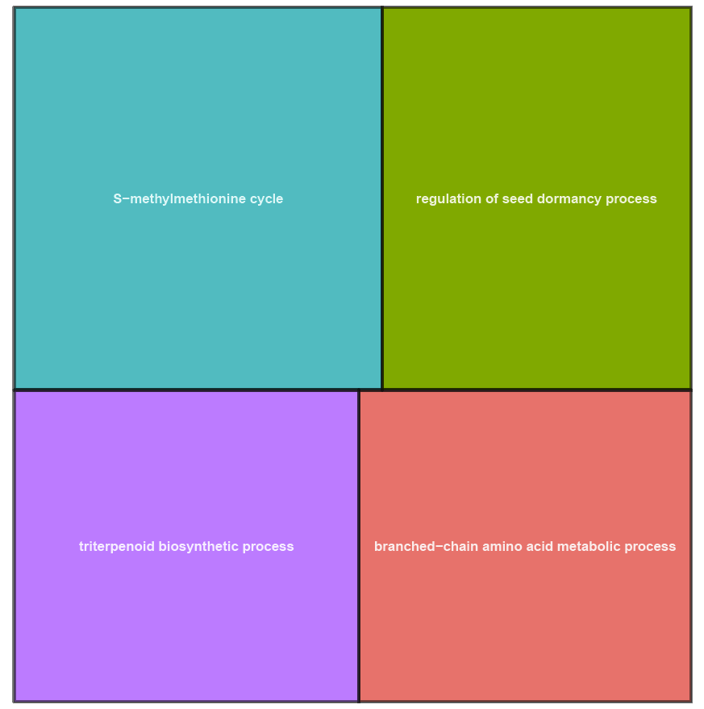

   Treemap of the enriched Gene Ontology term of the Biological Process class in unique Down-regulated genes of this sample 

(the actual output is in pdf format)

small RNA-seq
=============

Output tree
+++++++++++

::

	sRNA/
	├── chkpts/	# Checkpoint files; delete to trigger rerunning the corresponding analysis
	├── clusters/	# Clusters and differential analysis for all samples together: de novo clusters, all genes, and all TEs (optional)
	├── fastq/	# Processed FASTQ files
	├── logs/	# Log files
	├── mapped/	# ShortStack output subfolders for each replicate
	├── reports/	# QC reports (fastp/Cutadapt) and size statistics
	└── tracks/	# Bigwigs: plus and minus strand CPM for each replicate and merged replicates per sample, for each size class (default, 21, 22, 23, 24 nt)

Mapping statistics
++++++++++++++++++

- Data for each sample::

	results/sRNA/reports/sizes_stats__<Sample_ID>.txt

- Summary table:: 
	
	results/combined/reports/summary_sizes_stats_<analysis_name>_sRNA.txt

- Plot::
	
	results/combined/plots/srna_sizes_stats_<analysis_name>_sRNA.pdf # all sizes found in the raw data
	results/combined/plots/srna_sizes_stats_zoom_<analysis_name>_sRNA.pdf # zoom to chosen sizes (default 21 to 24nt)

- Example::

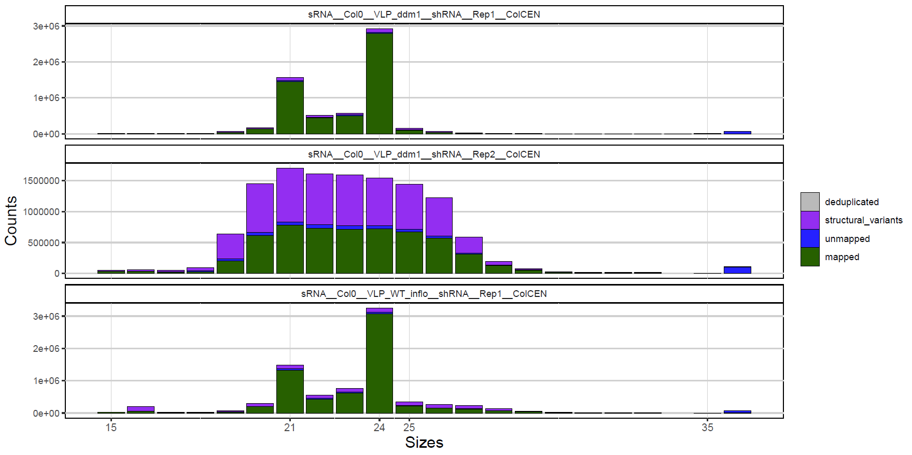

   Histogram of size distribution in small RNA samples

.. _ref-cluster-diff-expression:

Cluster and Differential Expression analysis
++++++++++++++++++++++++++++++++++++++++++++

Counts from ShortStack; analysis performed with EdgeR.

- ShortStack analysis on each replicate::

	results/sRNA/mapped/<Sample_ID>/       # ShortStack output folder with cluster results and alignment files
	results/sRNA/mapped/<Sample_ID>/clusters.bed  # simplified BED file of clusters for downstream analyses

- For all samples in the analysis, two runs will be performed by default (three with the optional TE analysis), which will create the same output
- The full ShortStack output will be located in these folders::
	
	results/clusters/<analysis_name>__<ref_genome>__on_new_clusters/ # Identifying small RNA clusters, normalizing accross all samples
	results/clusters/<analysis_name>__<ref_genome>__on_all_genes/ # Limiting mapping to all genes, normalizing accross all samples
	results/clusters/<analysis_name>__<ref_genome>__on_all_TEs/ # Limiting mapping to all TEs, normalizing accross all samples (optional)

- Each folder (e.g. on new clusters) will also contain the files required for edgeR analysis and output from the differential analysis, following the same pattern than for DEG analysis of RNAseq::

	results/clusters/<analysis_name>__<ref_genome>__on_new_clusters/counts_for_edgeR.txt # Count data for edgeR analysis
	results/clusters/<analysis_name>__<ref_genome>__on_new_clusters/samples_for_edgeR.txt # Table of samples information for edgeR analysis
	results/clusters/<analysis_name>__<ref_genome>__on_new_clusters/FC_<levels_label_1>_vs_<levels_label_2>.txt # log Fold Change between each pairs of samples at all clusters
	results/clusters/<analysis_name>__<ref_genome>__on_new_clusters/DEG_<levels_label_1>_vs_<levels_label_2>.txt # only differentially regulated clusters between each pair of samples
	results/clusters/<analysis_name>__<ref_genome>__on_new_clusters/unique_DEGs.txt # list of clusters uniquely regulated in each sample

- For each differential analysis (e.g. on new clusters), similar output than for RNAseq DEGs will be generated, following the naming pattern ``sRNA_<analysis_name>_<ref_genome>__on_new_clusters`` pattern. It includes::
	
	results/sRNA/reports/summary_DEG_stats__<analysis_name>__<refgenome>__on_new_clusters.txt # number of differential regulated clusters in all pairwise comparisons and uniquely regulated in each sample
	results/combined/plots/BCV_RNAseq_<analysis_name>_<ref_genome>.pdf # Biological Coefficient of Variation of all genes
	results/combined/plots/MDS_RNAseq_<analysis_name>_<ref_genome>_<d12|d12_labs|d23|d23_labs>.pdf # Multidimensional scaling, all four versions
	results/combined/plots/Heatmap_sRNA_<cpm|zscore>__<analysis_name>__<ref_genome>__on_new_clusters.pdf # expression values accross all differentially regulated clusters by count per million and zscore

(See :ref:`RNAseq <fig-bcv-deg>` for examples)

Upset Plot
++++++++++

Perfomed with ComplexUpset.

- Table of combined clusters identified in at least one of the small RNA replicates in the analysis, split by chosen sizes::

	results/combined/bedfiles/combined_clusters__sRNA__<analysis_name>__<ref_genome>.bed

- Table of combined clusters annotated based on the closest gene::

	results/combined/bedfiles/annotated__combined_clusters__sRNA__<analysis_name>__<ref_genome>.bed

- Upset plot::

	results/combined/plots/Upset_combined_clusters__sRNA__<analysis_name>__<ref_genome>.pdf

- Example:

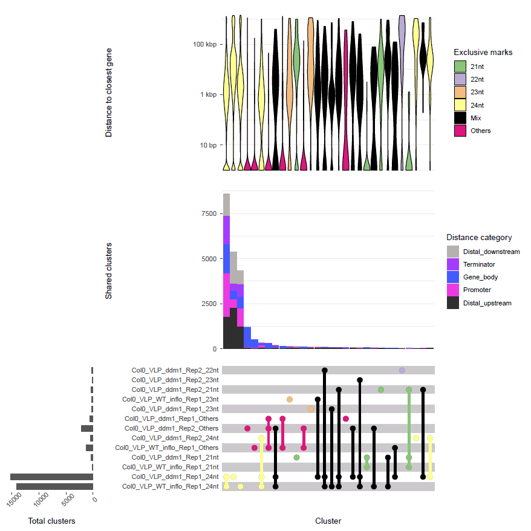

   Upset plot of small RNA clusters

DNA methylation
===============

Output tree
+++++++++++

::

	mC/
	├── chkpts/	# Checkpoint files; delete to trigger rerunning the corresponding analysis
	├── DMRs/	# Differentially methylated regions: DMR lists per context for pairwise comparisons and summary tables
	├── fastq/	# Processed FASTQ files
	├── logs/	# Log files
	├── mapped/	# Mapped reads (BAM)
	├── methylcall/	# CX report (Bismark-compatible) of methylation calls per cytosine
	├── reports/	# QC reports (fastp/Cutadapt) and mapping/methylation statistics (Bismark)
	└── tracks/	# Bigwigs: strand-specific and merged methylation percentage (0–100 %) for each replicate and per-sample merged; one set per active methylation_context

Mapping metrics
+++++++++++++++

- Data for each sample::

	results/mC/reports/summary_mC_<Read_layout>_mapping_stats_<Sample_ID>.txt

- Summary table::

	results/combined/reports/summary_mapping_stats_<analysis_name>_mC.txt

- Plot::

	results/combined/plots/mapping_stats_<analysis_name>_mC.pdf

(see :ref:`ChIP-seq <fig-mapping-stats>` for an example)

Methylation Calls
+++++++++++++++++

Performed with Bismark

- Methylation data for each sample::

	results/mC/reports/final_report_<Read_layout>__<Sample_ID>.html              # HTML summary from Bismark
	results/mC/reports/<Read_layout>__<Sample_ID>.deduplicated.cytosine_context_summary.txt  # methylation level per sequence context (Bismark)
	results/mC/reports/<Read_layout>__<Sample_ID>.deduplicated.M-bias.txt        # M-bias statistics (Bismark)
	results/mC/reports/<Read_layout>__<Sample_ID>.deduplicated_splitting_report.txt  # extraction statistics (Bismark)
	results/mC/methylcall/<Sample_ID>.deduplicated.CX_report.txt.gz              # per-cytosine methylation values and coverage

Differentially methylated regions analysis
++++++++++++++++++++++++++++++++++++++++++

Performed with DMRcaller. One set of DMR output files is produced for each
context listed in ``methylation_contexts`` (default: CG, CHG, CHH; see
:ref:`Configuration <configuration>` for details).

- BED files of DMRs in each context for each pairwise comparison::

	results/mC/DMRs/<SampleID_1>__vs__<SampleID_2>__CG_DMRs.txt   # DMRs in the CG context (if any)
	results/mC/DMRs/<SampleID_1>__vs__<SampleID_2>__CHG_DMRs.txt  # DMRs in the CHG context (if context is active and DMRs exist)
	results/mC/DMRs/<SampleID_1>__vs__<SampleID_2>__CHH_DMRs.txt  # DMRs in the CHH context (if context is active and DMRs exist)

- Summary table for each pairwise comparison::

	results/mC/DMRs/summary__<SampleID_1>__vs__<SampleID_2>__DMRs.txt  # Counts of hyper- and hypo-methylated regions per context

Combined Output
===============

Upset Plot
++++++++++

Perfomed with ComplexUpset.

- Table of combined peaks for all TF and histone ChIP-seq samples in the analysis::

	results/combined/bedfiles/combined_peaks__all_chip__<analysis_name>__<ref_genome>.bed

- Table of combined peaks for all TF and histone ChIP-seq samples in the analysis annotated based on the closest gene::

	results/combined/bedfiles/annotated__combined_peaks__all_chip__<analysis_name>__<ref_genome>.bed

- Upset plot::

	results/combined/plots/Upset_combined_peaks__all_chip__<analysis_name>__<ref_genome>.pdf

.. _fig-upset-peaks:

- Example:

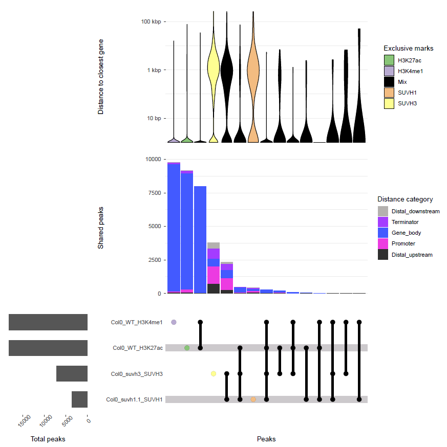

   Upset plot of peaks in all histone and TF ChIP-seq samples

Heatmaps and metaplots
++++++++++++++++++++++

Performed with Deeptools.

- Heatmaps and metaplots will be performed on all genes in the reference genome, and on all TEs in the TE file provided if optional TE analysis is selected.
- Three sets of heatmaps and metaplots will be generated with a corresponding prefix, aligning all regions on their Transcription Start Sites (*tss*), Transcription End sites (*tes*) and scaling all regions to the same lenght (*regions*) (used for examples below).
- DNA methylation samples are treated separately for these outputs due to different interpolation method requirement for vizualization ('nearest' instead of 'bilinear' for the other data types).

- Deeptool matrices and sorted region files::

	results/combined/matrix/final_matrix_regions__most__<analysis_name>__<ref_genome>__all_genes.gz # matrix scaled by regions for all samples except mC on all genes
	results/combined/matrix/final_matrix_regions__mC__<analysis_name>__<ref_genome>__all_genes.gz # matrix scaled by regions for mC samples on all genes
	results/combined/matrix/sorted_final_matrix_regions__mC__<analysis_name>__<ref_genome>__all_genes.gz # matrix scaled by regions for mC samples on all genes sorted according to other samples (only present if `heatmap_sort_mc_after_others` is set to `true`)
	results/combined/matrix/Heatmap__regions__most__<analysis_name>__<ref_genome>__all_genes_sorted_regions.bed # bed-file of regions of all genes in sorted order of all samples except mC

	results/combined/matrix/final_matrix_tss__most__<analysis_name>__<ref_genome>__all_genes.gz # matrix of regions aligned on TSS for all samples except mC on all genes
	results/combined/matrix/final_matrix_tss__mC__<analysis_name>__<ref_genome>__all_genes.gz # matrix of regions aligned on TSS for mC samples on all genes
	results/combined/matrix/sorted_final_matrix_tss__mC__<analysis_name>__<ref_genome>__all_genes.gz # matrix of regions aligned on TSS for mC samples on all genes sorted according to other samples (only present if `heatmap_sort_mc_after_others` is set to `true`)
	results/combined/matrix/Heatmap__tss__most__<analysis_name>__<ref_genome>__all_genes_sorted_regions.bed # bed-file of regions aligned on TSS of all genes in sorted order of all samples except mC

	results/combined/matrix/final_matrix_tes__most__<analysis_name>__<ref_genome>__all_genes.gz # matrix of regions aligned on TES for all samples except mC on all genes
	results/combined/matrix/final_matrix_tes__mC__<analysis_name>__<ref_genome>__all_genes.gz # matrix of regions aligned on TES for mC samples on all genes
	results/combined/matrix/sorted_final_matrix_tes__mC__<analysis_name>__<ref_genome>__all_genes.gz # matrix of regions aligned on TES for mC samples on all genes sorted according to other samples (only present if `heatmap_sort_mc_after_others` is set to `true`)
	results/combined/matrix/Heatmap__tes__most__<analysis_name>__<ref_genome>__all_genes_sorted_regions.bed # bed-file of regions aligned on TES of all genes in sorted order of all samples except mC

	#optional: if TE analysis is set to true, the same files will be generated for all regions in the provided TE file

- Heatmaps::

	results/combined/plots/Heatmap__regions__most__<analysis_name>__<ref_genome>__all_genes.pdf # heatmaps scaled by regions of all samples except mC, sorted by mean (default, can be changed in configuration)
	results/combined/plots/Heatmap_sorted__regions__mC__<analysis_name>__<ref_genome>__all_genes.pdf # heatmaps scaled by regions of mC samples, in the same sort order than all other samples above (if `heatmap_sort_mc_after_others` is set to `true`)
	results/combined/plots/Heatmap__regions__mC__<analysis_name>__<ref_genome>__all_genes.pdf # heatmaps scaled by regions of mC samples, sorted by mean (default, can be changed in configuration if `heatmap_sort_mc_after_others` is set to `false`)

	results/combined/plots/Heatmap__tss__most__<analysis_name>__<ref_genome>__all_genes.pdf # heatmaps of regions aligned on TSS of all samples except mC, sorted by mean (default, can be changed in configuration)
	results/combined/plots/Heatmap_sorted__tss__mC__<analysis_name>__<ref_genome>__all_genes.pdf # heatmaps of regions aligned on TSS of mC samples, in the same sort order than all other samples above (if `heatmap_sort_mc_after_others` is set to `true`)
	results/combined/plots/Heatmap__tss__mC__<analysis_name>__<ref_genome>__all_genes.pdf # heatmaps of regions aligned on TSS of mC samples, sorted by mean (default, can be changed in configuration if `heatmap_sort_mc_after_others` is set to `false`)

	results/combined/plots/Heatmap__tes__most__<analysis_name>__<ref_genome>__all_genes.pdf # heatmaps of regions aligned on TSS of all samples except mC, sorted by mean of all these samples (default, can be changed in configuration)
	results/combined/plots/Heatmap_sorted__tes__mC__<analysis_name>__<ref_genome>__all_genes.pdf # heatmaps of regions aligned on TSS of mC samples, in the same sort order than all other samples above (if `heatmap_sort_mc_after_others` is set to `true`)
	results/combined/plots/Heatmap__tes__mC__<analysis_name>__<ref_genome>__all_genes.pdf # heatmaps of regions aligned on TSS of mC samples, sorted by mean of all these mC samples (if `heatmap_sort_mc_after_others` is set to `false`)

	#optional: if TE analysis is set to true, the same files will be generated for all regions in the provided TE file

.. _fig-heatmap-deeptools:

- Examples::

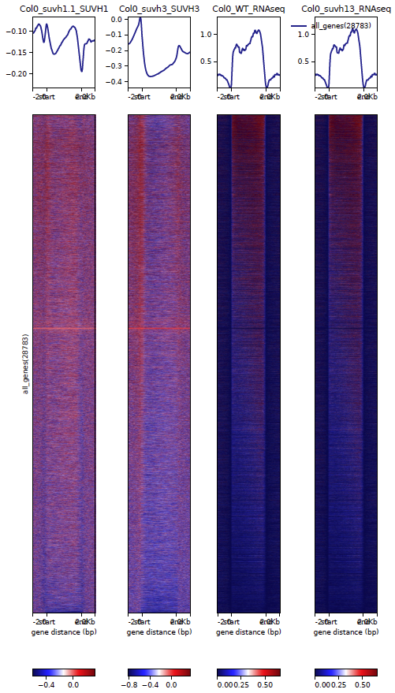

   Heatmap of scaled regions for all samples but mC at all genes

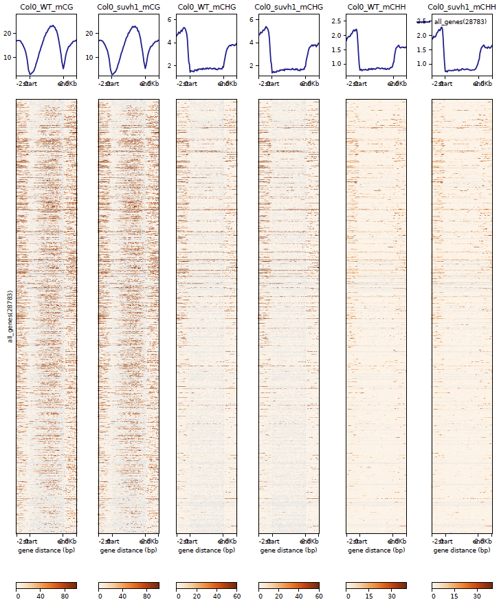

   Heatmap of scaled regions for mC samples at all genes in the same sorted order than above

- Metaplots::

	results/combined/plots/Profile__regions__most__<analysis_name>__<ref_genome>__all_genes.pdf # Metaplots of mean using lines (defaults, can be changed in configuration) scaled by regions of all samples except mC on all genes (each sample on its own plot).
	results/combined/plots/Profile_pergroup__regions__most__<analysis_name>__<ref_genome>__all_genes.pdf # Metaplots of mean using lines (defaults, can be changed in configuration) scaled by regions of all samples except mC on all genes (all samples on the same plot, can get messy).
	results/combined/plots/Profile__regions__mC__<analysis_name>__<ref_genome>__all_genes.pdf # Metaplots of mean using lines (defaults, can be changed in configuration) scaled by regions of mC samples on all genes (each sample on its own plot).
	results/combined/plots/Profile_pergroup__regions__mC__<analysis_name>__<ref_genome>__all_genes.pdf # Metaplots of mean using lines (defaults, can be changed in configuration) scaled by regions of mC samples on all genes (all samples on the same plot, can get messy).

	results/combined/plots/Profile__tss__most__<analysis_name>__<ref_genome>__all_genes.pdf # Metaplots of mean using lines (defaults, can be changed in configuration) aligned on TSS of all samples except mC on all genes (each sample on its own plot).
	results/combined/plots/Profile_pergroup__tss__most__<analysis_name>__<ref_genome>__all_genes.pdf # Metaplots of mean using lines (defaults, can be changed in configuration) aligned on TSS of all samples except mC on all genes (all samples on the same plot, can get messy).
	results/combined/plots/Profile__tss__mC__<analysis_name>__<ref_genome>__all_genes.pdf # Metaplots of mean using lines (defaults, can be changed in configuration) aligned on TSS of mC samples on all genes (each sample on its own plot).
	results/combined/plots/Profile_pergroup__tss__mC__<analysis_name>__<ref_genome>__all_genes.pdf # Metaplots of mean using lines (defaults, can be changed in configuration) aligned on TSS of mC samples on all genes (all samples on the same plot, can get messy).

	results/combined/plots/Profile__tes__most__<analysis_name>__<ref_genome>__all_genes.pdf # Metaplots of mean using lines (defaults, can be changed in configuration) aligned on TES of all samples except mC on all genes (each sample on its own plot).
	results/combined/plots/Profile_pergroup__tes__most__<analysis_name>__<ref_genome>__all_genes.pdf # Metaplots of mean using lines (defaults, can be changed in configuration) aligned on TES of all samples except mC on all genes (all samples on the same plot, can get messy).
	results/combined/plots/Profile__tes__mC__<analysis_name>__<ref_genome>__all_genes.pdf # Metaplots of mean using lines (defaults, can be changed in configuration) aligned on TES of mC samples on all genes (each sample on its own plot).
	results/combined/plots/Profile_pergroup__tes__mC__<analysis_name>__<ref_genome>__all_genes.pdf # Metaplots of mean using lines (defaults, can be changed in configuration) aligned on TES of mC samples on all genes (all samples on the same plot, can get messy).

	#optional: if TE analysis is set to true, the same files will be generated for all regions in the provided TE file

.. _fig-metaplot-deeptools:

- Examples::

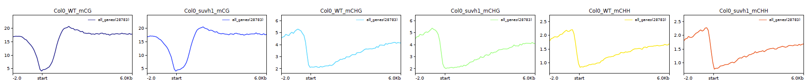

   Metaplot of all genes aligned on their TSS for mC samples

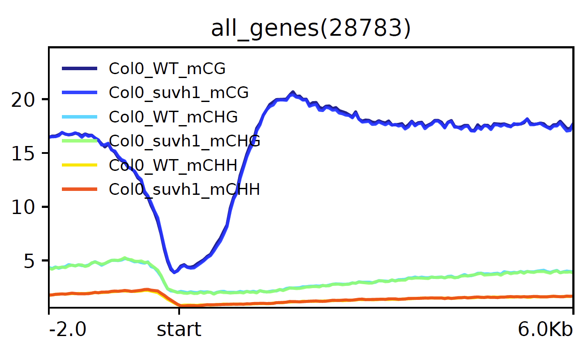

   Metaplot of all genes aligned on their TSS for mC samples on the same plot

(the actual outputs are in pdf format)

Browser screenshots
+++++++++++++++++++

Performed with Gviz.

- Browser shot over whole chromosomes::

	results/combined/plots/Browser_full_chromosomes__all__epicc__ColCEN.pdf # Browser of all the samples on full-length chromsomes

- Example::

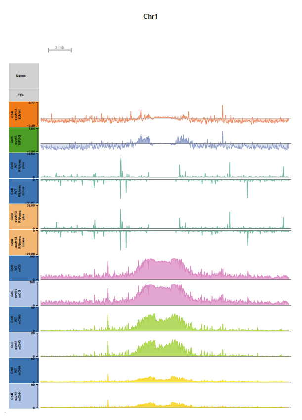

   Browser shot of full-length chromosome1 (binsize 50kb)

- Browser shot over target regions::

	results/combined/plots/Browser_interesting_genes__all__epicc__ColCEN.pdf # Browser of all the samples at the target loci `data/target_loci.bed`

.. _fig-browser-plot:

- Example::

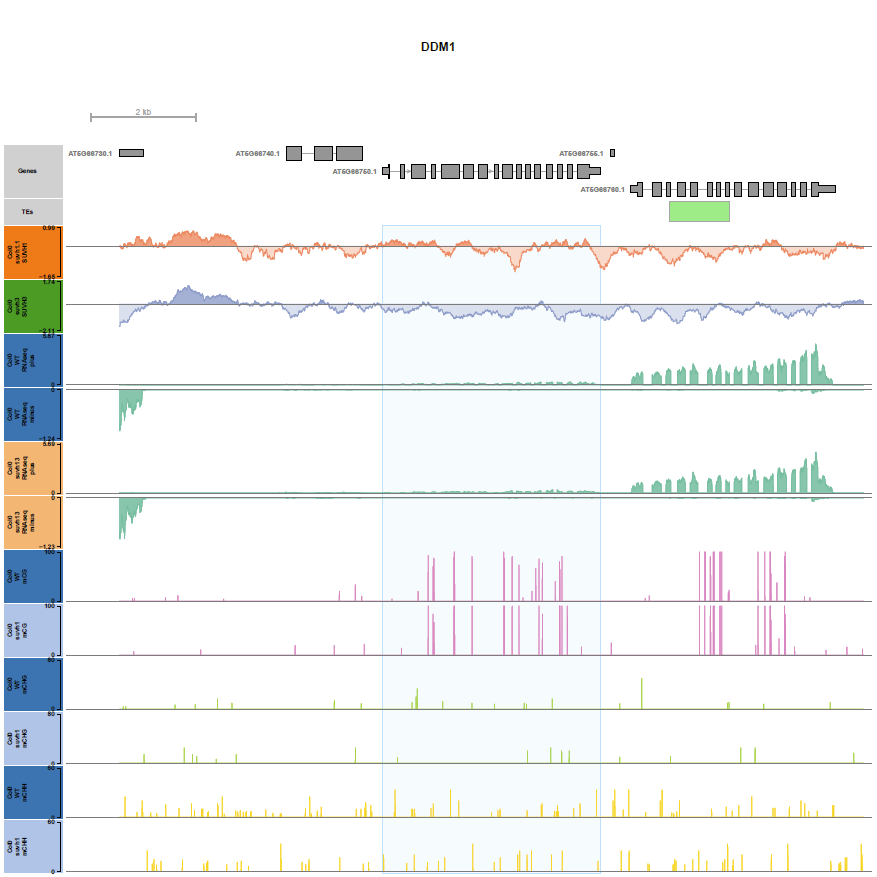

   Browser shot around a target loci, here the region surrounding the DDM1 gene (binsize 1bp)

(the actual output is in pdf format)
